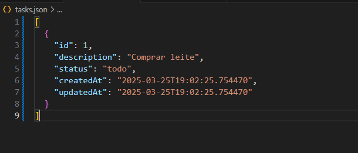

**

# Task Tracker CLI - README

**📝 Descrição**

O Task Tracker CLI é uma ferramenta de linha de comando para gerenciamento de tarefas pessoais. Ele permite criar, atualizar, deletar e listar tarefas, além de marcar seu status (a fazer, em progresso, concluído). Todas as tarefas são armazenadas em um arquivo JSON local.

**✨ Funcionalidades**

✅ Adicionar novas tarefas

✏️ Atualizar descrições de tarefas existentes

🗑️ Deletar tarefas

🔄 Alterar status das tarefas (todo, in-progress, done)

📋 Listar todas as tarefas ou filtrar por status

💾 Armazenamento persistente em arquivo JSON

**🚀 Instalação**

Clone o repositório ou baixe o arquivo task_cli.py:

    git clone https://github.com/anelors2/Task-Tracker-CLI
	cd task-tracker-cli

**🛠️ Como Usar**
	Comandos Básicos:
	
    # Adicionar nova tarefa
	 python task_cli.py add "Descrição da tarefa"
	 
    # Atualizar tarefa existente
    python task_cli.py update 1 "Nova descrição"
    
    # Deletar tarefa  
    python task_cli.py delete 1
    
    # Marcar tarefa como em progresso    
    python task_cli.py mark-in-progress 1
    
    # Marcar tarefa como concluída    
    python task_cli.py mark-done 1

    # Listar todas as tarefas    
    python task_cli.py list

    # Listar tarefas por status (todo, in-progress, done)    
    python task_cli.py list todo    
    python task_cli.py list in-progress    
    python task_cli.py list done

**📊 Estrutura do Arquivo de Tarefas**

